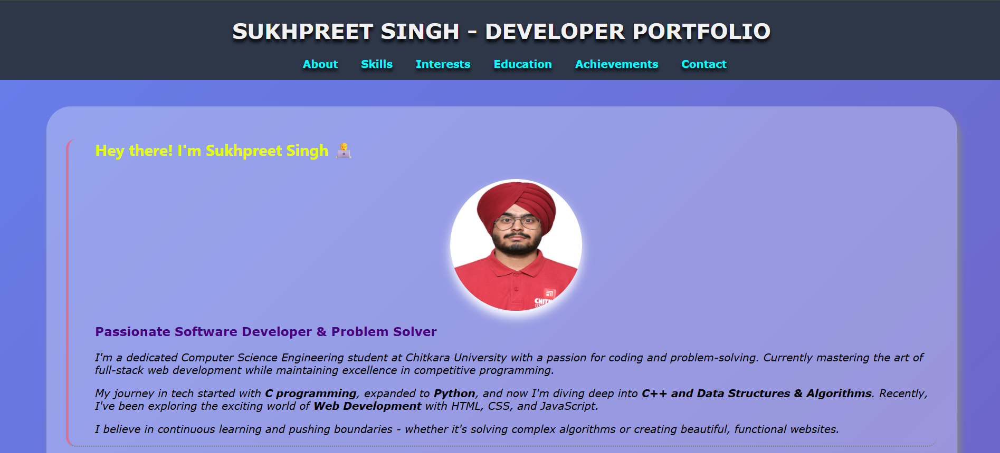

# 🌐 Sukhpreet Singh – Developer Portfolio

Welcome to my personal developer portfolio — built using **HTML5 & CSS3**, and proudly deployed with **GitHub Pages**.

---

## 🚀 Live Website

🔗 [Click to View My Portfolio](https://sukhpreet-singh2428.github.io/developer-portfolio/)

---

## 👨‍💻 About Me

I'm **Sukhpreet Singh**, a passionate **Computer Science Engineering** student at **Chitkara University**.

I enjoy building beautiful and functional websites, solving algorithmic challenges, and learning new technologies. This portfolio showcases my journey, skills, and achievements as a budding software developer.

---

## 🛠️ Tech Stack

- HTML5
- CSS3
- JavaScript (learning)
- C, C++, Python
- Data Structures & Algorithms
- Git & GitHub

---

## ✨ Features

- Responsive layout with clean sectioning  
- Animated UI elements with transitions and hover effects  
- Structured sections: About, Skills, Education, Achievements, Interests, Feedback  
- Deployed on GitHub Pages

---

## 📷 Screenshot

---

## 📬 Contact Me

Want to connect or collaborate? Use the contact form in the portfolio or reach out via GitHub!

> 💡 *This is my first portfolio project and will evolve as I grow. Feedback is always welcome!*

---

## 📌 Note

> Built as a beginner portfolio project — more interactive and responsive versions coming soon!

---

### 📄 License

This project is open source and available under the [MIT License](LICENSE).
